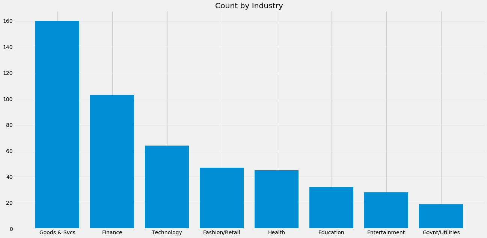
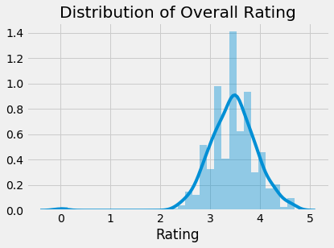
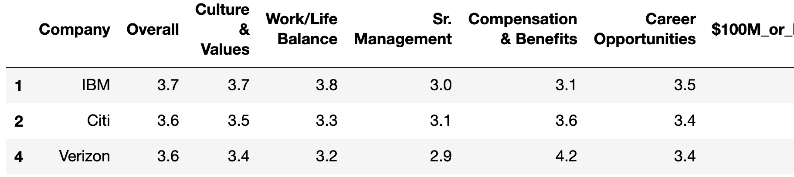
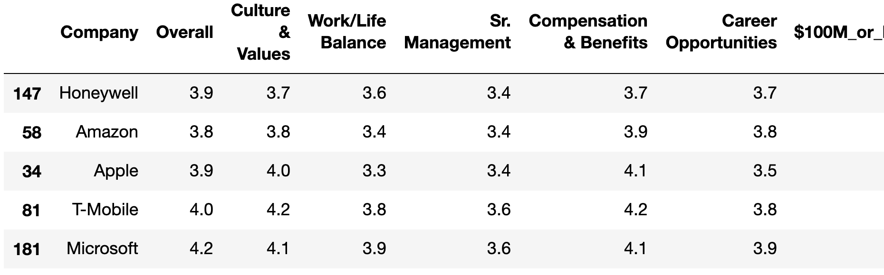
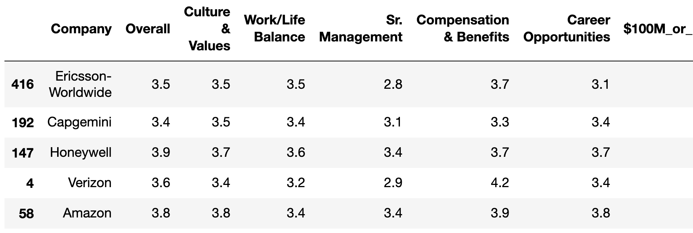
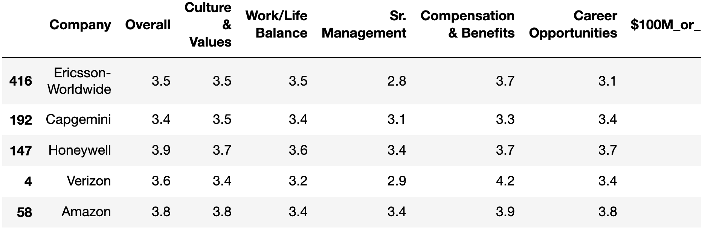
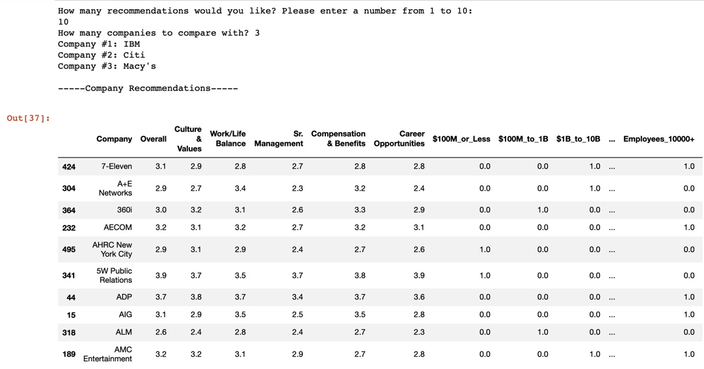

# Employer Recommendation System
by Haider Hussain and Jay Kim

## Goal
To create a recommendation system that suggests the top potential employers based on the user's preferences. In other words, the user selects their preferred employer and based off of various features about the preferred employers our system finds the most similar features and recommends other employers the user should consider.

## Sources/Tools
Primary data gathered from Glassdoor.com:
* Considered the top 5,000 potential employers. (using search results for New York City)

We created a content-based, item-to-item recommendation system using the K-Nearest Neighbors (Unsupervised Learning) algorithm. Python libraries included:
* Scikin learn Beautiful Soup
* Beautiful Soup 
* Selenium
* MySQL Server

## Exploratory Data Analysis
Bar graph Illustrating Popularity of Industry Type:

Distribution of Overall Rating for all Companies: 

#### Challenges
- Anonymous Users/Ratings: Cannot utilize collaborative filtering method approach
- Manual scraping (50 companies at a time)

## Features
Several Categories were too granular, and thus engineered into broader categories:
* Industry: 84 engineered into 12 categories
* Company Size: 8 engineered into 4 categories
* Revenue: 14 engineered intoto 4 categories

Sub-ratings were included as well with ratings from lowest to highest being 1-5:
* Culture & Values
* Work/Life Balance
* Senior Management
* Compensation and Benefits
* Career Opportunities

#### Modeling
- Nearest Neighbor Classification Model used to evaluate similarity across and between employers
- Various similarity metrics (Cosine, Minkowski, and Euclidean) were experimented with, along with 1-3 input test companies

#### Results
Lets say the following are our Top 3 favorite companies:

The Top 5 most similar to our favorite companies using Cosine as distance metric would be: 

The Top 5 most similar to our favorite companies using Minkowski as distance metric would be: 

###### The Winner
The Top 5 most similar to our favorite companies using Euclidean as distance metric would be: 

#### Future Considerations

More Data!
* _Find & Merge Related Datasets (including broader set of features)_
* _Deeper Layers of both EDA and Modeling_
* _(if at all possible) Finding a way to include user-based data would open up many possibilities)_

#### Conclusions
* Euclidean similarity metric turned out to be the best metric because the top 5 recommended companies features were more relatable to our group of favorite companies. The results using the Euclidean metric were the most similar and comparable to our favorite 3 companies across the various features. 

