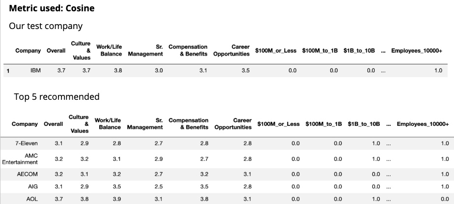
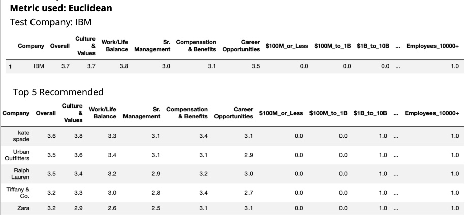

# Employer Recommendation System
by Ali Hussain and Jay Kim

## Goal
To create a recommendation system that suggests the top (custom) # of potential employers based on the user's input of comparable employer(s). In other words, the user selects the preferred employer(s); then our system recommends other employers the user should consider based on similar features.

## Sources/Tools
Primary data gathered from Glassdoor.com:
* Considered the top 5,000 potential employers returned (using search results for New York City)
Secondary sources of data include:
- 1)
- 2)

We created a content-based, item-to-item recommendation system using the K-Nearest Neighbors (Unsupervised Learning) algorithm along with:
* Beautiful Soup
* selenium
* (MySQL Server)
* scikitlearn library

## Exploratory Data Analysis
(EDA Graphics here)
#### Challenges
- Anonymous Users/Ratings: Missed opportunities to glean _user-based_ insights
- Had to Discard Main Company Rating: since it has no comparative relevance without user data
- No API/manual scraping (50 companies at a time)

## Features
Several Categories were too granular, and thus rolled up to broader categories:
* Industry: 84 rolled up to 12
* Company Size: 8 rolled up to 4
* Revenue: 14 rolled up to 4

The overall rating for each company had to be discarded from our analysis, but the sub-ratings were included (1-5):
* Culture & Values
* Work/Life Balance
* Senior Management
* Compensation and Benefits
* Career Opportunities

#### Modeling
- Nearest Neighbor Classification Model used to evaluate similarity across and between employers
- Various similarity metrics (Cosine, Minkowski, and Euclidean) were experimented with, along with 1-3 input companies
- (Preliminary test cases need to be further implemented)

#### Results 

#### Future Considerations

* _Find & Merge Related Datasets_
* _Deeper Layers of both EDA anD Modeling_

#### Conclusions
* Euclidean similarity metric turned out to be the best metric because the top 5 recommended companies features were more relatable to our test company
* (To be continued)
